# 🏗️ Architecture Deep Dive

## Table of Contents

- [Introduction](#introduction)
- [The Refactoring Journey](#the-refactoring-journey)
- [Architectural Principles](#architectural-principles)
- [Module Design](#module-design)
- [Design Patterns](#design-patterns)
- [Data Flow & Interactions](#data-flow--interactions)
- [Testing Strategy](#testing-strategy)
- [Student Learning Path](#student-learning-path)
- [Advanced Topics](#advanced-topics)
- [Design Decisions & Trade-offs](#design-decisions--trade-offs)

---

## Introduction

This document provides a deep dive into the architectural design of the Company Sustainability Scoring System. While the [README.md](README.md) explains **what** the system does, this document explains **why** it's designed this way and **how** it evolved.

### Purpose

This architecture document is designed to help:
- 👨‍🎓 **Students** understand modular software design
- 👨‍💻 **Developers** maintain and extend the system
- 📚 **Educators** teach software engineering principles
- 🔍 **Code Reviewers** understand design decisions

### Key Metrics

| Metric | Before Refactoring | After Refactoring | Improvement |
|--------|-------------------|-------------------|-------------|
| **Main File Size** | 1,183 lines | 148 lines | **87% reduction** |
| **Modules** | 6 monolithic | 12+ focused | **2x organization** |
| **Avg. Module Size** | 400+ lines | 100-200 lines | **Manageable** |
| **Test Coverage** | Hard to test | Mockable | **Testable** |
| **Prompt Location** | Embedded in code | Separate files | **Maintainable** |

---

## The Refactoring Journey

Understanding **where we came from** helps appreciate **where we are now**.

### Phase 1: The Monolithic Approach (Initial Version)


**Problems:**
- 🔴 Hard to find specific functionality
- 🔴 Difficult to test individual components
- 🔴 Merge conflicts when multiple people work
- 🔴 Prompts buried in code (hard to iterate)
- 🔴 Tightly coupled (changing one thing breaks others)

#### Example: Monolithic Code

```python
# ❌ OLD: Everything in one place
class MetricsExtractor:
    def extract_metrics(self, company_name, sources):
        # 50 lines of prompt text embedded here
        prompt = f"""
        You are an expert sustainability analyst.
        Analyze {company_name}'s sustainability...
        [many more lines]
        """

        # OpenAI client created here
        client = OpenAI(api_key=os.getenv('OPENAI_API_KEY'))

        # API call here
        response = client.chat.completions.create(
            model="gpt-4o-mini",
            messages=[
                {"role": "system", "content": "..."},
                {"role": "user", "content": prompt}
            ]
        )

        # Parsing here
        data = json.loads(response.choices[0].message.content)

        # Validation here
        # ... 50+ more lines ...
```

**Why This is Bad:**
1. **Single Responsibility Violated** - Doing 5+ things
2. **Hard to Test** - Can't mock the OpenAI client
3. **Hard to Change Prompts** - Buried in code
4. **Hard to Swap LLM Providers** - OpenAI hardcoded

---

### Phase 2: First Refactoring (Separation of Concerns)


**Improvements:**
- ✅ Separated by functional domain
- ✅ Database isolated
- ✅ Research logic separated

**Still Problems:**
- 🟡 Prompts still embedded
- 🟡 OpenAI client duplicated
- 🟡 UI still mixed with logic

---

### Phase 3: Full Modular Architecture (Current)


**Achievements:**
- ✅ **Clean Separation** - Each layer has clear responsibility
- ✅ **Reusable Components** - UI components can be reused
- ✅ **Testable** - Each module can be tested in isolation
- ✅ **Maintainable** - Easy to find and modify code
- ✅ **Extensible** - Easy to add new features

#### Example: Modular Code

```python
# ✅ NEW: Separated into modules

# prompts/extraction_prompts.py
METRICS_SCHEMA = { ... }

def create_metrics_extraction_prompt(company_name, content):
    """Prompt lives in its own file, easy to modify"""
    return f"""You are an expert... {company_name}..."""

# llm/client.py
class LLMClient:
    """Centralized LLM client, easy to swap providers"""
    def complete_json(self, prompt, system_message):
        # Single implementation, used everywhere
        pass

# analysis/extractor.py
class MetricsExtractor:
    """Focused on one job: extraction"""

    def __init__(self):
        self.llm_client = get_llm_client()  # Dependency injection!

    def extract_metrics(self, company_name, sources):
        # Create prompt from separate module
        prompt = create_metrics_extraction_prompt(company_name, content)

        # Use centralized client
        response = self.llm_client.complete_json(prompt, system_message)

        # Just focus on extraction logic
        return self._validate_metrics(response)
```

**Why This is Better:**
1. ✅ **Single Responsibility** - Each module does ONE thing
2. ✅ **Easy to Test** - Can mock `get_llm_client()`
3. ✅ **Easy to Change Prompts** - Just edit `prompts/` files
4. ✅ **Easy to Swap LLM** - Change `llm/client.py` once

---

## Architectural Principles

The architecture follows these core principles:

### 1. Separation of Concerns

**Definition:** Each module should have a single, well-defined responsibility.


**In Our System:**

| Concern | Module | Responsibility |
|---------|--------|----------------|
| **Prompts** | `prompts/` | All LLM prompts |
| **LLM Calls** | `llm/` | OpenAI communication |
| **Intent Logic** | `logic/` | Understanding user requests |
| **UI Components** | `ui/components/` | Reusable UI elements |
| **Intent Handlers** | `ui/intent_handlers/` | Executing user requests |
| **Research** | `research/` | Web search & scraping |
| **Analysis** | `analysis/` | Metrics & scoring |
| **Data** | `database/` | Data persistence |

### 2. Dependency Injection

**Definition:** Pass dependencies to objects instead of creating them internally.

```python
# ❌ BAD: Creating dependencies internally
class MetricsExtractor:
    def __init__(self):
        self.client = OpenAI(api_key=os.getenv('OPENAI_API_KEY'))  # Hardcoded!

# ✅ GOOD: Injecting dependencies
class MetricsExtractor:
    def __init__(self):
        self.llm_client = get_llm_client()  # Injected! Can be mocked!
```

**Benefits:**
- Easy to test (inject mocks)
- Easy to swap implementations
- Loose coupling

### 3. Don't Repeat Yourself (DRY)

**Definition:** Don't duplicate code or logic.

**In Our System:**
- ✅ Single `LLMClient` used everywhere
- ✅ Single `DatabaseManager` instance
- ✅ Prompts defined once in `prompts/`
- ✅ Reusable UI components

### 4. Single Responsibility Principle

**Definition:** A module should have one reason to change.

```python
# ✅ GOOD: Each handler has one job
# ui/intent_handlers/analyze.py - Only handles analysis
# ui/intent_handlers/compare.py - Only handles comparison
# ui/intent_handlers/rag.py - Only handles RAG questions
```

### 5. Open/Closed Principle

**Definition:** Open for extension, closed for modification.

**Example: Adding New Intent**

```python
# Don't modify existing code!
# Just add a new handler:

# ui/intent_handlers/export.py (NEW FILE)
def handle_export(companies):
    """Handle export intent"""
    # Export logic here
    pass

# ui/intent_handlers/__init__.py (ADD ONE LINE)
from ui.intent_handlers.export import handle_export

# app.py (ADD ONE CONDITION)
elif intent == "export":
    handle_export(companies)
```

---

## Module Design

### Layered Architecture


**Layer Rules:**
1. ⬇️ Layers only depend on layers below
2. ❌ Lower layers never depend on upper layers
3. ✅ Each layer has a clear interface

### Module Interactions

```mermaid
sequenceDiagram
    participant User
    participant UI as app.py
    participant Handler as intent_handlers/analyze.py
    participant Logic as logic/intents.py
    participant Research as research/agent.py
    participant Extractor as analysis/extractor.py
    participant LLM as llm/client.py
    participant Prompts as prompts/extraction_prompts.py
    participant DB as database/db_manager.py

    User->>UI: "Analyze Tesla"
    UI->>Logic: classify("Analyze Tesla")
    Logic->>LLM: classify intent
    LLM-->>Logic: {intent: "analyze"}
    Logic-->>UI: intent_data
    UI->>Handler: handle_analyze(["Tesla"])
    Handler->>Research: research_company("Tesla")
    Research-->>Handler: {sources: [...]}
    Handler->>Extractor: extract_metrics(sources)
    Extractor->>Prompts: create_extraction_prompt()
    Prompts-->>Extractor: prompt_text
    Extractor->>LLM: complete_json(prompt)
    LLM-->>Extractor: {metrics: [...]}
    Extractor-->>Handler: validated_metrics
    Handler->>DB: save_metrics()
    DB-->>Handler: success
    Handler-->>UI: "✅ Tesla analyzed!"
    UI-->>User: Display result
```



---

## Design Patterns

### 1. Singleton Pattern

**Used In:** `llm/client.py`, `logic/intents.py`

```python
# llm/client.py
_client_instance = None

def get_llm_client() -> LLMClient:
    """Get singleton instance"""
    global _client_instance
    if _client_instance is None:
        _client_instance = LLMClient()
    return _client_instance
```

**Why?**
- ✅ Only one OpenAI client instance (efficient)
- ✅ Shared configuration
- ✅ Easier to manage API rate limits

### 2. Strategy Pattern

**Used In:** `prompts/` modules

```python
# Different strategies for different tasks
prompts/
├── extraction_prompts.py    # Strategy: Extract metrics
├── intent_prompts.py         # Strategy: Classify intent
└── rag_prompts.py            # Strategy: Answer questions
```

**Why?**
- ✅ Easy to A/B test different prompts
- ✅ Swap strategies without changing code
- ✅ Version control tracks prompt evolution

### 3. Facade Pattern

**Used In:** `database/db_manager.py`

```python
class DatabaseManager:
    """Facade over SQLite operations"""

    def save_research(self, company_name, sources):
        # Hides complexity of:
        # - Creating/updating company
        # - Deleting old sources
        # - Inserting new sources
        # - Transaction management
        pass
```

**Why?**
- ✅ Simple interface to complex operations
- ✅ Hide implementation details
- ✅ Easy to switch database backend

### 4. Repository Pattern

**Used In:** `database/db_manager.py`

```python
# Database operations abstracted into repository
db.get_company(name)
db.save_research(name, sources)
db.get_recent_analysis(name, days)
```

**Why?**
- ✅ Centralized data access
- ✅ Easy to add caching
- ✅ Testable (can mock repository)

### 5. Template Method Pattern

**Used In:** Intent handlers

```python
# ui/intent_handlers/analyze.py
def handle_analyze(companies):
    """Template: Analyze companies"""
    for company in companies:
        # Step 1: Research
        sources = research_agent.research_company(company)
        # Step 2: Extract
        metrics = extractor.extract_metrics(company, sources)
        # Step 3: Score
        scores = scorer.calculate_final_score(metrics)
        # Step 4: Save
        db.save_scores(company_id, scores)
```

**Why?**
- ✅ Consistent workflow
- ✅ Easy to modify steps
- ✅ Clear process

---

## Data Flow & Interactions

### Complete Analysis Flow


### Database-First Architecture

**Principle:** Database is the single source of truth.


**Why Database-First?**
- ✅ Data persistence
- ✅ Single source of truth
- ✅ Easy to reload after restart
- ✅ Enables caching
- ✅ Supports multiple sessions

### Caching Strategy

```python
# Streamlit cache decorator
@st.cache_data(ttl=10)  # 10-second cache
def get_companies_from_db():
    """Cache database queries"""
    # Expensive database operation
    return db.get_all_companies()

# Manual cache invalidation
def delete_company(name):
    db.delete_company(name)
    get_companies_from_db.clear()  # Clear cache!
    st.rerun()
```

**Benefits:**
- ⚡ Faster UI updates
- 💰 Fewer database queries
- 🔄 Controlled invalidation

---

## Testing Strategy

### Unit Testing with Mocks

```python
# ✅ Easy to test with modular architecture

# Test metrics extractor WITHOUT calling OpenAI
def test_extractor():
    # Create mock
    mock_llm = Mock()
    mock_llm.complete_json.return_value = '{"metrics": [...]}'

    # Inject mock
    extractor = MetricsExtractor()
    extractor.llm_client = mock_llm

    # Test
    metrics = extractor.extract_metrics("Tesla", sources)

    # Assertions
    assert len(metrics) == 15
    assert mock_llm.complete_json.called
    # No real API call made! ✅
```

### Integration Testing

```python
# Test full pipeline
def test_analysis_pipeline():
    # Use real components
    research_agent = ResearchAgent()
    extractor = MetricsExtractor()
    scorer = SustainabilityScorer()
    db = DatabaseManager()

    # Execute pipeline
    sources = research_agent.research_company("Tesla")
    metrics = extractor.extract_metrics("Tesla", sources)
    scores = scorer.calculate_final_score(metrics)

    # Verify end-to-end
    assert scores['final_score'] >= 0
    assert scores['final_score'] <= 100
```

### Test Pyramid


---

## Student Learning Path

### Recommended Order


### Learning Modules

| Week | Focus | Files to Study | Concepts |
|------|-------|----------------|----------|
| **1** | Data Collection | `research/`, `database/` | APIs, SQL, CRUD |
| **2** | AI Integration | `llm/`, `prompts/`, `analysis/` | LLMs, Prompt Engineering |
| **3** | UI & Integration | `ui/`, `app.py` | Streamlit, Event Handling |

### Key Concepts by Module

**prompts/ - Prompt Engineering**
```python
# Learn:
# - How to structure LLM prompts
# - JSON output formatting
# - Few-shot learning
# - System vs User messages
```

**llm/ - API Abstraction**
```python
# Learn:
# - Wrapper pattern
# - Singleton pattern
# - Error handling
# - Dependency injection
```

**logic/ - Business Logic**
```python
# Learn:
# - Intent classification
# - Natural language understanding
# - Routing patterns
# - Separation of concerns
```

**ui/intent_handlers/ - Command Pattern**
```python
# Learn:
# - Handler pattern
# - Command pattern
# - Orchestration
# - State management
```

---

## Advanced Topics

### 1. Prompt Engineering Best Practices

```python
# ✅ GOOD PROMPT: Clear, specific, with examples
def create_extraction_prompt(company, content):
    return f"""
    Role: You are an expert sustainability analyst

    Task: Extract exactly 15 metrics for {company}

    Data: {content}

    Output Format (JSON):
    {{
        "metrics": [
            {{
                "category": "Environmental",
                "metric_name": "Carbon Emissions Reduction",
                "value": 75.5,
                "confidence": 0.9
            }}
        ]
    }}

    Requirements:
    - Scores: 0-100
    - Confidence: 0-1
    - Exactly 5 metrics per category
    """
```

### 2. Database Foreign Keys (Critical!)

```sql
-- ✅ Foreign keys MUST be enabled
PRAGMA foreign_keys = ON;

-- This enables CASCADE DELETE
CREATE TABLE research_sources (
    company_id INTEGER,
    FOREIGN KEY (company_id) REFERENCES companies(id) ON DELETE CASCADE
);

-- Now: DELETE FROM companies WHERE id = 1
-- Also deletes all related sources, metrics, scores automatically!
```

### 3. Streamlit Caching

```python
# Cache expensive operations
@st.cache_data(ttl=10)
def expensive_query():
    # This runs only once every 10 seconds
    return db.query()

# Cache with custom hash
@st.cache_data(hash_funcs={DatabaseManager: id})
def query_with_db(db):
    return db.get_data()
```

### 4. Error Handling Strategy

```python
# Layered error handling
try:
    # Try operation
    result = api_call()
except APIError as e:
    # Log error
    logger.error(f"API failed: {e}")
    # Return graceful fallback
    return default_value
except Exception as e:
    # Catch unexpected errors
    logger.critical(f"Unexpected: {e}")
    # Re-raise for debugging
    raise
```

---

## Design Decisions & Trade-offs

### Why SQLite over PostgreSQL?

**Decision:** Use SQLite for data storage

**Pros:**
- ✅ Zero configuration
- ✅ Single file database
- ✅ Perfect for development/education
- ✅ Easy to backup (copy file)
- ✅ No server needed

**Cons:**
- ⚠️ Not ideal for high concurrency
- ⚠️ Limited to single machine

**Trade-off:** Simplicity over scalability (good for education!)

### Why Streamlit over React?

**Decision:** Use Streamlit for UI

**Pros:**
- ✅ Pure Python (no JavaScript)
- ✅ Fast development
- ✅ Built-in components
- ✅ Perfect for data apps
- ✅ Easy for students

**Cons:**
- ⚠️ Less customizable than React
- ⚠️ Server-side only

**Trade-off:** Development speed over flexibility

### Why GPT-4o-mini over GPT-4?

**Decision:** Use GPT-4o-mini for analysis

**Pros:**
- ✅ 10x cheaper
- ✅ Faster responses
- ✅ Good enough accuracy
- ✅ Better for students (budget)

**Cons:**
- ⚠️ Slightly less accurate
- ⚠️ Smaller context window

**Trade-off:** Cost over marginal accuracy

### Why Modular over Monolithic?

**Decision:** Fully modular architecture

**Pros:**
- ✅ Easy to understand
- ✅ Easy to test
- ✅ Easy to maintain
- ✅ Great for learning
- ✅ Team collaboration

**Cons:**
- ⚠️ More files to navigate
- ⚠️ More imports to manage

**Trade-off:** Maintainability over simplicity

---

## Conclusion

This architecture evolved from a monolithic 1,183-line file to a clean, modular system with 12+ focused modules. The key to this transformation was applying solid software engineering principles:

1. **Separation of Concerns** - Each module has one job
2. **Dependency Injection** - Easy to test and swap implementations
3. **Single Responsibility** - Clear, focused modules
4. **DRY Principle** - No code duplication
5. **Database-First** - Single source of truth

The result is a codebase that is:
- 📚 **Educational** - Students learn best practices
- 🧪 **Testable** - Easy to write tests
- 🔧 **Maintainable** - Easy to find and fix bugs
- 🚀 **Extensible** - Easy to add features
- 👥 **Collaborative** - Multiple people can work together

---

**For More Information:**
- See [README.md](README.md) for system overview
- See [STUDENT_GUIDE.md](STUDENT_GUIDE.md) for 3-week learning path
- See inline code comments for implementation details

**Built with ❤️ to teach clean architecture and modular design**
