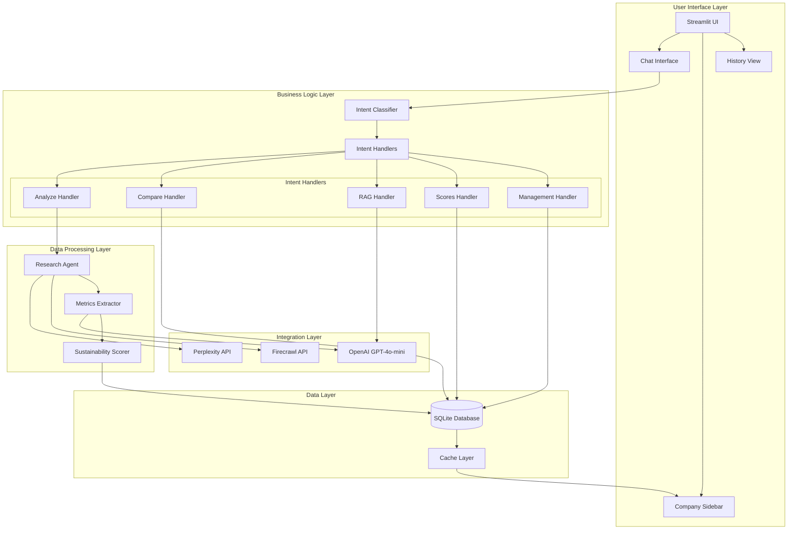
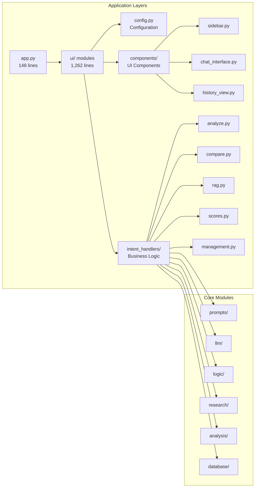
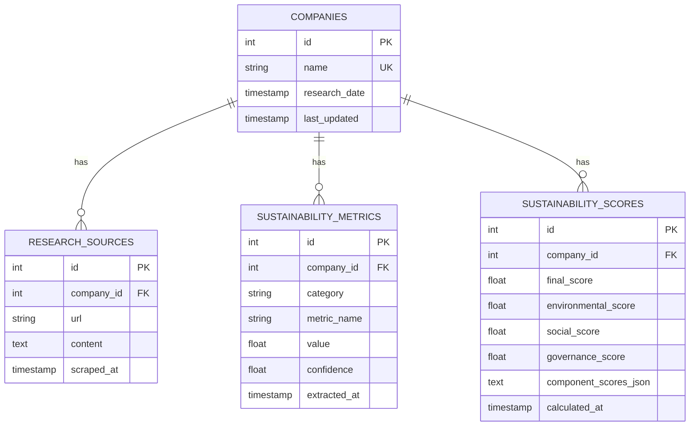
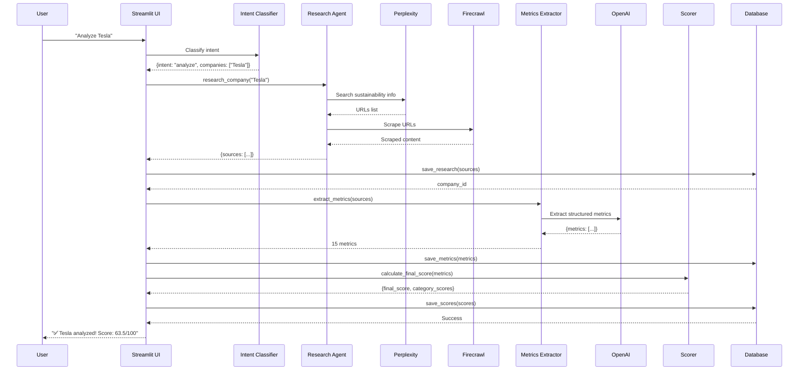
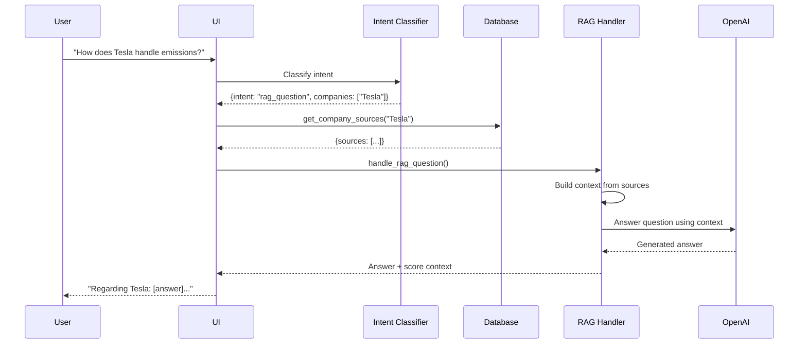
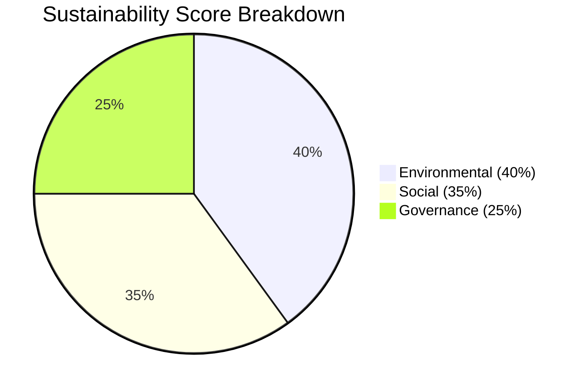

# 🤖 Multi Agent Company Research System

A comprehensive AI-powered multi-agent system for researching, analyzing, and scoring companies' Environmental, Social, and Governance (ESG) sustainability practices. This system employs multiple specialized agents working together to provide deep insights into corporate sustainability performance.

[](https://www.python.org/downloads/)
[](https://streamlit.io/)
[](https://openai.com/)
[](LICENSE)

---

## 📑 Table of Contents

- [Overview](#-overview)
- [Features](#-features)
- [Architecture](#-architecture)
- [Project Structure](#-project-structure)
- [Technology Stack](#-technology-stack)
- [Installation](#-installation)
- [Usage](#-usage)
- [Database Schema](#-database-schema)
- [Data Flow](#-data-flow)
- [API Integrations](#-api-integrations)
- [Scoring Methodology](#-scoring-methodology)
- [Configuration](#-configuration)
- [Development](#-development)
- [Contributing](#-contributing)
- [License](#-license)

---

## 🎯 Overview

The **Multi Agent Company Research System** is an intelligent multi-agent platform that automatically researches, analyzes, and scores companies based on their ESG (Environmental, Social, and Governance) practices. Using cutting-edge AI agents and web scraping technologies, it employs specialized agents for research, extraction, scoring, and Q&A to provide comprehensive insights into corporate sustainability performance.

### Key Capabilities

- 🔍 **Automated Research** - Leverages Perplexity AI for intelligent web research
- 🌐 **Web Scraping** - Uses Firecrawl for high-quality content extraction
- 🤖 **AI Analysis** - Employs GPT-4o-mini for metrics extraction and insights
- 💬 **Conversational Interface** - Natural language chat for easy interaction
- 📊 **Comprehensive Scoring** - Weighted scoring across 15 sustainability metrics
- 💾 **Database-First** - SQLite with proper foreign key constraints and caching
- 🏗️ **Modular Architecture** - Clean, maintainable, and extensible codebase

---

## ✨ Features

### Core Features

| Feature | Description |
|---------|-------------|
| **Company Analysis** | Research and analyze any company's sustainability practices |
| **Multi-Company Comparison** | Compare ESG scores across multiple companies |
| **RAG Q&A** | Ask specific questions about companies using scraped data |
| **Score Breakdown** | Detailed metrics across Environmental, Social, and Governance categories |
| **Historical Tracking** | View all previously analyzed companies |
| **Chat Interface** | Natural language interaction with AI assistant |
| **Real-time Updates** | Fresh data with configurable cache expiry |
| **Data Management** | Delete individual companies or clear all data |

### Conversational Commands

The chat interface understands natural language commands:

```
✅ "Analyze Tesla"
✅ "Compare Apple and Microsoft"
✅ "What's Tesla's environmental score?"
✅ "How does Amazon handle carbon emissions?"
✅ "Show me Tesla's strengths and weaknesses"
✅ "Delete Microsoft from the database"
```

---

## 🏗️ Architecture

### System Architecture



### Modular Architecture



---

## 📁 Project Structure

```
/Users/prince/DSDA/
├── app.py                          # Main Streamlit application (148 lines)
│
├── ui/                             # User Interface modules (1,262 lines)
│   ├── __init__.py                # UI module documentation
│   ├── config.py                  # Streamlit configuration & CSS
│   ├── components/                # Reusable UI components
│   │   ├── __init__.py
│   │   ├── sidebar.py            # Company list sidebar
│   │   ├── chat_interface.py     # Chat UI helpers
│   │   └── history_view.py       # History table view
│   └── intent_handlers/           # Chat intent handlers
│       ├── __init__.py
│       ├── analyze.py            # Analyze companies
│       ├── compare.py            # Compare companies
│       ├── rag.py                # RAG question answering
│       ├── scores.py             # Score display handlers
│       └── management.py         # Delete/clear operations
│
├── prompts/                        # LLM prompt templates
│   ├── extraction_prompts.py     # Metrics extraction prompts
│   ├── intent_prompts.py         # Intent classification prompts
│   └── rag_prompts.py            # RAG Q&A prompts
│
├── llm/                            # LLM client wrapper
│   └── client.py                 # Centralized OpenAI client
│
├── logic/                          # Business logic
│   └── intents.py                # Intent classification
│
├── research/                       # Research & data collection
│   └── agent.py                  # Perplexity + Firecrawl integration
│
├── analysis/                       # Data analysis
│   ├── extractor.py              # AI-powered metrics extraction
│   └── scorer.py                 # Sustainability scoring algorithm
│
├── database/                       # Data persistence
│   ├── schema.sql                # Database schema
│   └── db_manager.py             # Database operations (CRUD)
│
├── .env                            # Environment variables (API keys)
├── requirements.txt                # Python dependencies
├── README.md                       # This file
├── ARCHITECTURE.md                 # Detailed architecture documentation
└── STUDENT_GUIDE.md                # 3-week project guide for students
```

---

## 🛠️ Technology Stack

### Core Technologies

| Category | Technology | Purpose |
|----------|-----------|---------|
| **Frontend** | Streamlit | Interactive web interface |
| **Language** | Python 3.9+ | Core programming language |
| **Database** | SQLite | Local data persistence |
| **AI/ML** | OpenAI GPT-4o-mini | Metrics extraction & analysis |
| **Research** | Perplexity API | Intelligent web search |
| **Scraping** | Firecrawl API | Content extraction |

### Python Libraries

```python
# Core Dependencies
streamlit >= 1.28.0        # Web UI framework
openai >= 1.0.0            # OpenAI API client
pandas >= 2.0.0            # Data manipulation
sqlite3                    # Database (built-in)

# Visualization
plotly >= 5.0.0            # Interactive charts

# Utilities
python-dotenv >= 1.0.0     # Environment management
requests >= 2.31.0         # HTTP requests
```

---

## 🚀 Installation

### Prerequisites

- Python 3.9 or higher
- pip (Python package manager)
- OpenAI API key
- Perplexity API key
- Firecrawl API key

### Step 1: Clone the Repository

```bash
git clone <repository-url>
cd DSDA
```

### Step 2: Install Dependencies

```bash
pip install -r requirements.txt
```

### Step 3: Configure Environment Variables

Create a `.env` file in the project root:

```bash
# OpenAI API Configuration
OPENAI_API_KEY=sk-...

# Perplexity API Configuration
PERPLEXITY_API_KEY=pplx-...

# Firecrawl API Configuration
FIRECRAWL_API_KEY=fc-...

# Database Configuration
DATABASE_PATH=sustainability_data.db
CACHE_EXPIRY_DAYS=7
```

### Step 4: Initialize Database

```bash
python -c "from database.db_manager import DatabaseManager; DatabaseManager()"
```

### Step 5: Run the Application

```bash
streamlit run app.py
```

The app will open in your browser at `http://localhost:8501`

---

## 💡 Usage

### Basic Workflow

1. **Start the Application**
   ```bash
   streamlit run app.py
   ```

2. **Analyze a Company**
   - Type in chat: `"Analyze Tesla"`
   - System will:
     - Research company using Perplexity
     - Scrape content with Firecrawl
     - Extract metrics using GPT-4o-mini
     - Calculate sustainability scores
     - Save to database

3. **Compare Companies**
   - Type: `"Compare Tesla and Apple"`
   - View side-by-side scores and insights

4. **Ask Questions**
   - Type: `"How does Tesla handle carbon emissions?"`
   - Get AI-generated answers based on scraped data

### Chat Commands

| Command | Example | Description |
|---------|---------|-------------|
| Analyze | `"Check out Microsoft"` | Analyze a single company |
| Compare | `"Compare Tesla and Apple"` | Compare 2+ companies |
| Score | `"What's Tesla's score?"` | Show overall score |
| Category | `"Tesla's environmental performance"` | Show category-specific metrics |
| Details | `"Tell me more about Apple"` | Detailed analysis |
| Strengths | `"What is Tesla good at?"` | Top performing metrics |
| Question | `"How does Apple handle diversity?"` | RAG-based Q&A |
| List | `"Show all companies"` | List analyzed companies |
| Delete | `"Delete Microsoft"` | Remove specific company |
| Clear | `"Clear everything"` | Remove all data |

---

## 💾 Database Schema



### Table Descriptions

| Table | Purpose | Key Features |
|-------|---------|--------------|
| `companies` | Company records | Unique names, timestamp tracking |
| `research_sources` | Scraped content | URLs and content, CASCADE delete |
| `sustainability_metrics` | Extracted metrics | 15 metrics per company, categorized |
| `sustainability_scores` | Calculated scores | Final + category scores, JSON details |

---

## 🔄 Data Flow

### Analysis Pipeline



### RAG Question Answering



---

## 🔌 API Integrations

### Perplexity API

**Purpose:** Intelligent web search for company sustainability information

```python
# Configuration
BASE_URL: "https://api.perplexity.ai"
MODEL: "llama-3.1-sonar-small-128k-online"

# Usage
research_agent.search_company(company_name)
# Returns: List of relevant URLs
```

### Firecrawl API

**Purpose:** High-quality web content extraction

```python
# Configuration
BASE_URL: "https://api.firecrawl.dev"

# Usage
research_agent.scrape_url(url)
# Returns: Cleaned markdown content
```

### OpenAI API

**Purpose:** AI-powered analysis and extraction

```python
# Configuration
MODEL: "gpt-4o-mini"
TEMPERATURE: 0.2 (metrics extraction)
TEMPERATURE: 0.3 (RAG questions)

# Usage
1. Metrics Extraction: Extract 15 sustainability metrics
2. Intent Classification: Understand user commands
3. RAG Q&A: Answer questions using context
```

---

## 📊 Scoring Methodology

### Category Weights



### Metrics Schema

| Category | Metrics (5 per category) | Weight |
|----------|--------------------------|--------|
| **Environmental** | Carbon Emissions Reduction<br>Renewable Energy Usage<br>Waste Management<br>Water Conservation<br>Sustainable Materials | 40% |
| **Social** | Employee Diversity & Inclusion<br>Labor Rights & Fair Wages<br>Community Engagement<br>Health & Safety<br>Customer Privacy | 35% |
| **Governance** | Board Independence<br>Ethical Business Practices<br>Transparency & Reporting<br>Anti-Corruption Measures<br>Shareholder Rights | 25% |

### Calculation Formula

```python
# Step 1: Calculate category scores
category_score = weighted_average(metrics_in_category, confidence_weights)

# Step 2: Calculate final score
final_score = (
    environmental_score * 0.40 +
    social_score * 0.35 +
    governance_score * 0.25
)

# Step 3: Apply score level
# 85-100: Excellent
# 70-84:  Good
# 50-69:  Fair
# 30-49:  Poor
# 0-29:   Very Poor
```

---

## ⚙️ Configuration

### Environment Variables

| Variable | Description | Default |
|----------|-------------|---------|
| `OPENAI_API_KEY` | OpenAI API key | Required |
| `PERPLEXITY_API_KEY` | Perplexity API key | Required |
| `FIRECRAWL_API_KEY` | Firecrawl API key | Required |
| `DATABASE_PATH` | SQLite database file | `sustainability_data.db` |
| `CACHE_EXPIRY_DAYS` | Cache validity period | `7` |

### Customization

**Modify Metrics Schema:**
```python
# Edit: prompts/extraction_prompts.py
METRICS_SCHEMA = {
    "Environmental": [...],
    "Social": [...],
    "Governance": [...]
}
```

**Adjust Category Weights:**
```python
# Edit: analysis/scorer.py
CATEGORY_WEIGHTS = {
    "Environmental": 0.40,
    "Social": 0.35,
    "Governance": 0.25
}
```

**Change Cache Duration:**
```bash
# In .env file
CACHE_EXPIRY_DAYS=14  # 2 weeks
```

---

## 🧪 Development

### Running Tests

```bash
# Test metrics extractor
python analysis/extractor.py

# Test research agent
python research/agent.py

# Test database manager
python database/db_manager.py
```

### Code Quality

- **Modularity:** Each file has single responsibility
- **Documentation:** Comprehensive docstrings
- **Type Hints:** Function signatures include types
- **Error Handling:** Try-except blocks with logging
- **Caching:** Streamlit cache for performance
- **Foreign Keys:** Enabled for data integrity

### Architecture Principles

1. **Separation of Concerns** - UI, logic, and data layers
2. **Dependency Injection** - Pass dependencies, don't create them
3. **Single Responsibility** - Each module has one job
4. **DRY (Don't Repeat Yourself)** - Centralized LLM client and prompts
5. **Database-First** - Database as single source of truth

---

## 🤝 Contributing

We welcome contributions! Please follow these guidelines:

1. **Fork the repository**
2. **Create a feature branch** (`git checkout -b feature/amazing-feature`)
3. **Make your changes** (follow existing code style)
4. **Add tests** (if applicable)
5. **Commit your changes** (`git commit -m 'Add amazing feature'`)
6. **Push to branch** (`git push origin feature/amazing-feature`)
7. **Open a Pull Request**

### Code Style

- Follow PEP 8 guidelines
- Use meaningful variable names
- Add docstrings to all functions
- Include Student Guide comments
- Keep functions under 50 lines

---

## 📄 License

This project is licensed under the MIT License - see the [LICENSE](LICENSE) file for details.

---

## 📞 Support

For questions or issues:

- **GitHub Issues:** [Create an issue](https://github.com/yourusername/dsda/issues)
- **Documentation:** See [ARCHITECTURE.md](ARCHITECTURE.md)
- **Student Guide:** See [STUDENT_GUIDE.md](STUDENT_GUIDE.md)

---

## 🙏 Acknowledgments

- **OpenAI** for GPT-4o-mini API
- **Perplexity AI** for intelligent search
- **Firecrawl** for web scraping capabilities
- **Streamlit** for the excellent UI framework
- **SQLite** for lightweight database solution

---

## 📈 Project Stats

- **Total Lines of Code:** ~3,500
- **Modules:** 12 core modules
- **UI Components:** 3 reusable components
- **Intent Handlers:** 5 specialized handlers
- **Database Tables:** 4 with foreign key relationships
- **API Integrations:** 3 (OpenAI, Perplexity, Firecrawl)
- **Sustainability Metrics:** 15 across 3 categories

---
