# 📚 Student Guide: Company Sustainability Scoring System
## A 3-Week Data Science & Analytics Project

---

## 📖 Table of Contents

- [Introduction](#-introduction)
- [Learning Objectives](#-learning-objectives)
- [Prerequisites](#-prerequisites)
- [Required Resources](#-required-resources)
- [Using Cursor AI](#-using-cursor-ai)
- [Week 1: Foundation & Core Modules](#-week-1-foundation--core-modules)
- [Week 2: Data Pipeline & Analysis](#-week-2-data-pipeline--analysis)
- [Week 3: UI & Integration](#-week-3-ui--integration)
- [Best Practices](#-best-practices)
- [Troubleshooting](#-troubleshooting)
- [Assessment Criteria](#-assessment-criteria)
- [Additional Resources](#-additional-resources)

---

## 🎯 Introduction

Welcome to the **Company Sustainability Scoring System** project! Over the next 3 weeks, you'll build a complete AI-powered system that researches, analyzes, and scores companies' sustainability practices.

### What You'll Build


### Project Complexity

| Aspect | Level | Description |
|--------|-------|-------------|
| **Python Programming** | Intermediate | Object-oriented, modular design |
| **API Integration** | Beginner | REST APIs, JSON handling |
| **Database** | Beginner | SQLite, basic CRUD operations |
| **AI/ML** | Beginner | Using LLM APIs, prompt engineering |
| **Web Development** | Beginner | Streamlit framework |
| **Data Science** | Intermediate | Weighted scoring, data analysis |

---

## 🎓 Learning Objectives

By the end of this project, you will be able to:

### Technical Skills
- ✅ Design and implement modular Python applications
- ✅ Integrate multiple third-party APIs (OpenAI, Perplexity, Firecrawl)
- ✅ Build and manage SQLite databases
- ✅ Create interactive web applications with Streamlit
- ✅ Implement AI-powered features (LLMs, RAG)
- ✅ Design weighted scoring algorithms
- ✅ Handle asynchronous operations and caching

### Data Science Skills
- ✅ Collect and process web data
- ✅ Extract structured information from unstructured text
- ✅ Calculate weighted averages and confidence scores
- ✅ Visualize data with charts and tables
- ✅ Implement data validation and cleaning

### Software Engineering Skills
- ✅ Apply separation of concerns principle
- ✅ Write clean, documented code
- ✅ Use environment variables for configuration
- ✅ Implement error handling and logging
- ✅ Create reusable components
- ✅ Follow best practices for code organization

---

## 📋 Prerequisites

### Required Knowledge

| Topic | Importance | Resources |
|-------|-----------|-----------|
| **Python Basics** | Essential | Variables, functions, classes, imports |
| **API Concepts** | Essential | HTTP requests, JSON, REST APIs |
| **SQL Basics** | Helpful | SELECT, INSERT, UPDATE, DELETE |
| **Git** | Helpful | Clone, commit, push |
| **Command Line** | Essential | Navigate directories, run commands |

### Skill Assessment

**Can you do this?** (If yes, you're ready!)

```python
# 1. Create a class
class Company:
    def __init__(self, name):
        self.name = name

# 2. Use a dictionary
data = {"score": 75, "level": "Good"}

# 3. Iterate over a list
companies = ["Tesla", "Apple"]
for company in companies:
    print(company)

# 4. Handle errors
try:
    result = 10 / 0
except ZeroDivisionError:
    print("Cannot divide by zero")
```

---

## 🔧 Required Resources

### 1. Software Installation


| Software | Version | Download Link | Purpose |
|----------|---------|---------------|---------|
| **Python** | 3.9+ | [python.org](https://www.python.org/downloads/) | Core language |
| **Cursor AI** | Latest | [cursor.sh](https://cursor.sh/) | AI-powered IDE (recommended) |
| **VS Code** | Latest | [code.visualstudio.com](https://code.visualstudio.com/) | Alternative IDE |
| **Git** | Latest | [git-scm.com](https://git-scm.com/) | Version control |

### 2. API Keys (Free Tiers Available)

| Service | Purpose | Sign Up Link | Free Tier |
|---------|---------|--------------|-----------|
| **OpenAI** | AI analysis & extraction | [platform.openai.com](https://platform.openai.com/signup) | $5 credit |
| **Perplexity** | Web research | [perplexity.ai/settings/api](https://www.perplexity.ai/settings/api) | Limited requests |
| **Firecrawl** | Web scraping | [firecrawl.dev](https://firecrawl.dev/) | 500 credits/month |

### 3. Python Libraries

Create a `requirements.txt` file:

```txt
streamlit>=1.28.0
openai>=1.0.0
pandas>=2.0.0
plotly>=5.0.0
python-dotenv>=1.0.0
requests>=2.31.0
```

Install with:
```bash
pip install -r requirements.txt
```

### 4. Project Budget

**Estimated Costs (for 3-week project):**

| Service | Cost | Notes |
|---------|------|-------|
| OpenAI API | $2-$5 | Depends on usage |
| Perplexity API | Free | With limits |
| Firecrawl API | Free | 500 credits |
| **Total** | **$2-$5** | Very affordable! |

---

## 🤖 Using Cursor AI

**Cursor** is an AI-powered code editor that makes development much easier!

### Why Use Cursor?


### Setup Cursor

1. **Download and Install**
   ```bash
   # Download from https://cursor.sh/
   # Install like any other application
   ```

2. **Import Your Project**
   ```bash
   # Open Cursor
   # File > Open Folder > Select your DSDA directory
   ```

3. **Enable AI Features**
   - Press `Cmd+K` (Mac) or `Ctrl+K` (Windows)
   - Ask Cursor to help with code!

### Cursor Shortcuts

| Action | Shortcut | Use Case |
|--------|----------|----------|
| **AI Chat** | `Cmd+L` | Ask questions about code |
| **AI Edit** | `Cmd+K` | Get AI to write/modify code |
| **Autocomplete** | `Tab` | Accept AI suggestions |
| **Explain Code** | `Cmd+Shift+E` | Understand complex code |
| **Fix Bug** | `Cmd+Shift+F` | AI debugs your code |

### Example Cursor Prompts

```plaintext
"Explain what this function does"
"Add error handling to this code"
"Create a function that calculates weighted average"
"Write a docstring for this class"
"Refactor this code to be more modular"
"Add type hints to all function parameters"
```

### Cursor Best Practices

1. **Be Specific**
   - ❌ "Fix this"
   - ✅ "Add input validation to check if company_name is not empty"

2. **Ask for Explanations**
   - "Explain this SQL query"
   - "Why does this function return None?"

3. **Request Best Practices**
   - "Is there a better way to structure this?"
   - "Add error handling following Python best practices"

4. **Get Code Reviews**
   - "Review this function for potential bugs"
   - "Suggest improvements to this code"

---

## 📅 Week 1: Foundation & Core Modules

### Overview

**Goal:** Set up the project and build core data collection modules

**Time Allocation:**
- Monday-Tuesday: Setup & Research Agent (6 hours)
- Wednesday-Thursday: Database Module (6 hours)
- Friday: Testing & Documentation (3 hours)

---

### Day 1-2: Project Setup & Research Agent

#### Tasks Checklist

- [ ] **Environment Setup**
  - [ ] Install Python 3.9+
  - [ ] Install Cursor or VS Code
  - [ ] Create project directory
  - [ ] Initialize Git repository
  - [ ] Create virtual environment
  - [ ] Install dependencies

- [ ] **API Configuration**
  - [ ] Sign up for OpenAI API
  - [ ] Sign up for Perplexity API
  - [ ] Sign up for Firecrawl API
  - [ ] Create `.env` file
  - [ ] Test API connections

- [ ] **Build Research Agent**
  - [ ] Create `research/` folder
  - [ ] Implement Perplexity search
  - [ ] Implement Firecrawl scraping
  - [ ] Add error handling
  - [ ] Write test function

#### Step-by-Step Guide

**Step 1: Create Project Structure**

```bash
# Create project directory
mkdir DSDA
cd DSDA

# Create folder structure
mkdir research analysis database prompts llm logic ui
mkdir ui/components ui/intent_handlers

# Create __init__.py files
touch research/__init__.py
touch analysis/__init__.py
touch database/__init__.py
touch prompts/__init__.py
touch llm/__init__.py
touch logic/__init__.py
touch ui/__init__.py
```

**Step 2: Set Up Environment**

```bash
# Create virtual environment
python3 -m venv venv

# Activate virtual environment
# On Mac/Linux:
source venv/bin/activate
# On Windows:
venv\Scripts\activate

# Install dependencies
pip install streamlit openai pandas plotly python-dotenv requests
```

**Step 3: Create `.env` File**

```bash
# Create .env file
touch .env
```

Edit `.env`:
```bash
OPENAI_API_KEY=sk-your-key-here
PERPLEXITY_API_KEY=pplx-your-key-here
FIRECRAWL_API_KEY=fc-your-key-here
DATABASE_PATH=sustainability_data.db
CACHE_EXPIRY_DAYS=7
```

**Step 4: Build Research Agent**

Create `research/agent.py`:

```python
"""
Research Agent - Perplexity + Firecrawl Integration

STUDENT TASK: Complete the TODOs below
"""

import os
import requests
from dotenv import load_dotenv

load_dotenv()

class ResearchAgent:
    """
    Researches company sustainability using Perplexity and Firecrawl.

    TODO: Add docstring explaining what this class does
    """

    def __init__(self):
        # TODO: Initialize API keys from environment variables
        self.perplexity_key = os.getenv('PERPLEXITY_API_KEY')
        self.firecrawl_key = os.getenv('FIRECRAWL_API_KEY')

    def search_company(self, company_name: str):
        """
        Search for company sustainability information using Perplexity.

        TODO: Implement Perplexity API call
        - Create the search query
        - Make HTTP POST request
        - Extract and return URLs
        """
        # Your code here
        pass

    def scrape_url(self, url: str):
        """
        Scrape content from a URL using Firecrawl.

        TODO: Implement Firecrawl API call
        - Make HTTP POST request to Firecrawl
        - Extract cleaned content
        - Return markdown text
        """
        # Your code here
        pass

# TODO: Add test function
if __name__ == "__main__":
    agent = ResearchAgent()
    print("Testing research agent...")
    # Test your functions here
```

#### Using Cursor to Help

1. **Open the file in Cursor**
2. **Select the `search_company` function**
3. **Press `Cmd+K` and ask:**
   ```
   "Implement this function to call Perplexity API for searching
   company sustainability information. Use requests library.
   Return list of URLs."
   ```

4. **Review the generated code**
5. **Ask for explanations:**
   ```
   "Explain this code line by line"
   ```

#### Learning Activity

**📊 Data Flow Diagram**


**Questions to Answer:**
1. Why do we separate search and scraping?
2. What happens if an API call fails?
3. How would you add rate limiting?

---

### Day 3-4: Database Module

#### Tasks Checklist

- [ ] **Database Design**
  - [ ] Design schema (4 tables)
  - [ ] Understand foreign keys
  - [ ] Create ERD diagram

- [ ] **Implement Database Manager**
  - [ ] Create `database/schema.sql`
  - [ ] Create `database/db_manager.py`
  - [ ] Implement CRUD operations
  - [ ] Enable foreign keys
  - [ ] Add caching logic

#### Step-by-Step Guide

**Step 1: Design Database Schema**

Create `database/schema.sql`:

```sql
-- Companies Table
-- TODO: Add comments explaining each column
CREATE TABLE IF NOT EXISTS companies (
    id INTEGER PRIMARY KEY AUTOINCREMENT,
    name TEXT NOT NULL UNIQUE,
    research_date TIMESTAMP DEFAULT CURRENT_TIMESTAMP,
    last_updated TIMESTAMP DEFAULT CURRENT_TIMESTAMP
);

-- TODO: Complete the other 3 tables
-- 1. research_sources
-- 2. sustainability_metrics
-- 3. sustainability_scores

-- TODO: Add indexes for better query performance
CREATE INDEX IF NOT EXISTS idx_companies_name ON companies(name);
```

**Step 2: Implement Database Manager**

Create `database/db_manager.py`:

```python
"""
Database Manager - SQLite Operations

STUDENT TASK: Complete the implementation
"""

import sqlite3
import os
from typing import List, Dict, Optional

class DatabaseManager:
    """
    Manages all database operations for the sustainability scoring system.

    TODO: Add detailed class docstring
    """

    def __init__(self, db_path: str = None):
        # TODO: Initialize database connection
        # TODO: Enable foreign keys (CRITICAL!)
        # TODO: Create tables from schema.sql
        pass

    def save_research(self, company_name: str, sources: List[Dict]):
        """
        Save research data for a company.

        TODO: Implement this function
        Steps:
        1. Insert/update company record
        2. Delete old sources (if any)
        3. Insert new sources
        4. Return company_id
        """
        pass

    def get_recent_analysis(self, company_name: str, days: int = 7):
        """
        Get recent analysis for a company (cache check).

        TODO: Implement cache logic
        - Check if company exists
        - Check if analysis is within 'days' period
        - Return all related data if valid
        - Return None if cache miss
        """
        pass

# TODO: Add test code
```

#### Database Schema Visualization


#### Learning Activity

**Exercise: Foreign Keys**

```sql
-- What happens when you delete a company?
DELETE FROM companies WHERE name = 'Tesla';

-- Answer: With CASCADE DELETE, all related records
-- (sources, metrics, scores) are automatically deleted!

-- TODO: Write a query to verify this behavior
```

**Questions:**
1. Why do we need foreign keys?
2. What is CASCADE DELETE?
3. How does caching improve performance?

---

### Day 5: Testing & Documentation

#### Tasks Checklist

- [ ] **Testing**
  - [ ] Test Research Agent with real API
  - [ ] Test Database operations
  - [ ] Verify foreign keys work
  - [ ] Test cache mechanism

- [ ] **Documentation**
  - [ ] Add docstrings to all functions
  - [ ] Create README for Week 1
  - [ ] Document API usage
  - [ ] Write reflection notes

#### Testing Guide

**Test 1: Research Agent**

```python
# test_research.py
from research.agent import ResearchAgent

def test_search():
    agent = ResearchAgent()
    urls = agent.search_company("Tesla")

    assert len(urls) > 0, "Should return URLs"
    print(f"✅ Found {len(urls)} URLs")

def test_scrape():
    agent = ResearchAgent()
    url = "https://tesla.com/impact"
    content = agent.scrape_url(url)

    assert len(content) > 0, "Should return content"
    print(f"✅ Scraped {len(content)} characters")

if __name__ == "__main__":
    test_search()
    test_scrape()
    print("🎉 All tests passed!")
```

**Test 2: Database**

```python
# test_database.py
from database.db_manager import DatabaseManager

def test_save_and_retrieve():
    db = DatabaseManager()

    # Save test data
    sources = [
        {"url": "http://example.com", "content": "Test content"}
    ]
    company_id = db.save_research("TestCo", sources)

    assert company_id > 0, "Should return company ID"
    print(f"✅ Saved company with ID: {company_id}")

    # Retrieve data
    result = db.get_recent_analysis("TestCo")
    assert result is not None, "Should find recent analysis"
    print("✅ Retrieved recent analysis")

if __name__ == "__main__":
    test_save_and_retrieve()
    print("🎉 Database tests passed!")
```

#### Week 1 Deliverables

| Deliverable | Status | Notes |
|-------------|--------|-------|
| Research Agent | ✅ | With Perplexity + Firecrawl |
| Database Schema | ✅ | 4 tables with foreign keys |
| Database Manager | ✅ | CRUD + caching |
| Tests | ✅ | All functions tested |
| Documentation | ✅ | Docstrings + README |

---

## 📅 Week 2: Data Pipeline & Analysis

### Overview

**Goal:** Build AI-powered analysis and scoring modules

**Time Allocation:**
- Monday-Tuesday: LLM Integration (6 hours)
- Wednesday-Thursday: Metrics Extraction (6 hours)
- Friday: Scoring Algorithm (3 hours)

---

### Day 1-2: LLM Integration & Prompts

#### Tasks Checklist

- [ ] **LLM Client**
  - [ ] Create centralized OpenAI client
  - [ ] Implement `complete()` method
  - [ ] Implement `complete_json()` method
  - [ ] Add error handling

- [ ] **Prompt Engineering**
  - [ ] Design metrics extraction prompt
  - [ ] Design intent classification prompt
  - [ ] Design RAG prompt
  - [ ] Test prompts with real data

#### Step-by-Step Guide

**Step 1: Create LLM Client**

Create `llm/client.py`:

```python
"""
LLM Client - Centralized OpenAI Wrapper

STUDENT TASK: Implement the LLM client
"""

from openai import OpenAI
import os

class LLMClient:
    """
    Centralized client for OpenAI API calls.

    TODO: Why is centralization important?
    """

    def __init__(self):
        # TODO: Initialize OpenAI client
        self.api_key = os.getenv('OPENAI_API_KEY')
        self.client = OpenAI(api_key=self.api_key)
        self.default_model = "gpt-4o-mini"

    def complete(self, prompt: str, system_message: str = None,
                 temperature: float = 0.2, max_tokens: int = 1000):
        """
        Get a text completion from the LLM.

        TODO: Implement this method
        Args:
            prompt: The user's prompt
            system_message: Optional system role message
            temperature: Randomness (0-1)
            max_tokens: Max response length

        Returns:
            str: The LLM's response
        """
        # Your code here
        pass

    def complete_json(self, prompt: str, system_message: str = None):
        """
        Get a JSON completion (forced JSON format).

        TODO: Implement JSON mode
        Hint: Use response_format={"type": "json_object"}
        """
        # Your code here
        pass
```

**Step 2: Design Prompts**

Create `prompts/extraction_prompts.py`:

```python
"""
Metrics Extraction Prompts

STUDENT TASK: Design effective prompts
"""

# Define the metrics we want to extract
METRICS_SCHEMA = {
    "Environmental": [
        "Carbon Emissions Reduction",
        "Renewable Energy Usage",
        "Waste Management",
        "Water Conservation",
        "Sustainable Materials"
    ],
    # TODO: Add Social metrics (5)
    # TODO: Add Governance metrics (5)
}

def create_metrics_extraction_prompt(company_name: str, content: str):
    """
    Create prompt for extracting sustainability metrics.

    TODO: Design an effective prompt that:
    1. Explains the task clearly
    2. Provides the metrics schema
    3. Specifies output format (JSON)
    4. Includes examples
    """

    prompt = f"""
    You are an expert sustainability analyst.

    Task: Extract sustainability metrics for {company_name}

    Content:
    {content}

    TODO: Complete this prompt to:
    - Specify all 15 metrics
    - Request scores 0-100
    - Request confidence levels 0-1
    - Require JSON format output
    """

    return prompt

# TODO: Add system message
METRICS_EXTRACTION_SYSTEM_MESSAGE = """
Your system message here...
"""
```

#### Prompt Engineering Best Practices


**Prompt Template:**

```
[ROLE]
You are a [specific role]

[TASK]
Your task is to [specific task]

[CONTEXT]
Here is the information: [data]

[FORMAT]
Output format: [JSON/text/etc]

[EXAMPLE]
Example output:
{
  "field1": "value1"
}
```

#### Learning Activity

**Exercise: Test Different Temperatures**

```python
# Test how temperature affects output
for temp in [0.0, 0.5, 1.0]:
    response = client.complete(
        prompt="Describe Tesla's sustainability",
        temperature=temp
    )
    print(f"Temperature {temp}: {response}\n")

# TODO: What did you observe?
# - temp=0.0: ___________
# - temp=0.5: ___________
# - temp=1.0: ___________
```

---

### Day 3-4: Metrics Extraction

#### Tasks Checklist

- [ ] **Build Extractor**
  - [ ] Create `analysis/extractor.py`
  - [ ] Implement extraction logic
  - [ ] Add validation
  - [ ] Handle edge cases

- [ ] **Testing**
  - [ ] Test with sample data
  - [ ] Verify JSON parsing
  - [ ] Check metric validation

#### Step-by-Step Guide

**Create `analysis/extractor.py`:**

```python
"""
Metrics Extractor - AI-Powered Metrics Extraction

STUDENT TASK: Implement the extractor
"""

from llm.client import get_llm_client
from prompts.extraction_prompts import (
    METRICS_SCHEMA,
    create_metrics_extraction_prompt
)
import json

class MetricsExtractor:
    """
    Extracts sustainability metrics using AI.
    """

    def __init__(self):
        # TODO: Initialize LLM client
        pass

    def extract_metrics(self, company_name: str, sources: list):
        """
        Extract 15 sustainability metrics from research sources.

        TODO: Implement extraction pipeline
        Steps:
        1. Combine content from all sources
        2. Create extraction prompt
        3. Call LLM
        4. Parse JSON response
        5. Validate metrics
        6. Return validated metrics
        """
        pass

    def _validate_metrics(self, metrics: list):
        """
        Validate extracted metrics.

        TODO: Implement validation
        - Check required fields exist
        - Verify category is valid
        - Clamp values to 0-100
        - Clamp confidence to 0-1
        """
        pass
```

#### Data Flow


---

### Day 5: Scoring Algorithm

#### Tasks Checklist

- [ ] **Implement Scorer**
  - [ ] Create `analysis/scorer.py`
  - [ ] Calculate category scores
  - [ ] Calculate final score
  - [ ] Generate recommendations

#### Step-by-Step Guide

**Create `analysis/scorer.py`:**

```python
"""
Sustainability Scorer - Weighted Scoring Algorithm

STUDENT TASK: Implement scoring logic
"""

class SustainabilityScorer:
    """
    Calculates sustainability scores using weighted averages.
    """

    CATEGORY_WEIGHTS = {
        "Environmental": 0.40,  # 40%
        "Social": 0.35,         # 35%
        "Governance": 0.25      # 25%
    }

    def calculate_final_score(self, metrics: list):
        """
        Calculate final score from 15 metrics.

        TODO: Implement scoring algorithm

        Steps:
        1. Group metrics by category
        2. Calculate category scores (weighted by confidence)
        3. Calculate final score (weighted by category weights)
        4. Determine score level
        5. Return all scores

        Formula:
        category_score = sum(metric.value * metric.confidence) / sum(confidence)
        final_score = sum(category_score * category_weight)
        """
        pass
```

#### Scoring Visualization

```mermaid
graph LR
    A[15 Metrics] --> B[Environmental<br/>5 metrics]
    A --> C[Social<br/>5 metrics]
    A --> D[Governance<br/>5 metrics]

    B --> E[Env Score<br/>×0.40]
    C --> F[Social Score<br/>×0.35]
    D --> G[Gov Score<br/>×0.25]

    E --> H[Final Score]
    F --> H
    G --> H
```



#### Week 2 Deliverables

| Deliverable | Status | Notes |
|-------------|--------|-------|
| LLM Client | ✅ | Centralized OpenAI wrapper |
| Prompts | ✅ | Extraction, Intent, RAG |
| Metrics Extractor | ✅ | 15 metrics extraction |
| Scorer | ✅ | Weighted algorithm |
| Tests | ✅ | All modules tested |

---

## 📅 Week 3: UI & Integration

### Overview

**Goal:** Build complete Streamlit UI and integrate all modules

**Time Allocation:**
- Monday-Tuesday: UI Components (6 hours)
- Wednesday-Thursday: Chat Interface (6 hours)
- Friday: Testing & Polish (3 hours)

---

### Day 1-2: UI Components

#### Tasks Checklist

- [ ] **Setup Streamlit**
  - [ ] Create `ui/config.py`
  - [ ] Design page layout
  - [ ] Add custom CSS

- [ ] **Build Components**
  - [ ] Sidebar component
  - [ ] History view component
  - [ ] Chat interface helpers

#### Step-by-Step Guide

**Create `ui/config.py`:**

```python
"""
Streamlit Configuration

STUDENT TASK: Configure the UI
"""

import streamlit as st

def setup_page_config():
    """
    Configure Streamlit page settings.

    TODO: Set page title, icon, layout
    """
    st.set_page_config(
        page_title="Sustainability Scorer",
        page_icon="🌱",
        layout="wide"
    )

def apply_custom_css():
    """
    Apply custom CSS styling.

    TODO: Add CSS for chat messages, buttons, etc.
    """
    st.markdown("""
    <style>
        /* Your CSS here */
    </style>
    """, unsafe_allow_html=True)
```

**Create `ui/components/sidebar.py`:**

```python
"""
Sidebar Component - Company List

STUDENT TASK: Implement sidebar
"""

import streamlit as st
from database.db_manager import DatabaseManager

def render_sidebar():
    """
    Render sidebar with company list.

    TODO: Implement sidebar
    - Fetch companies from database
    - Display with scores
    - Add delete buttons
    - Add clear all button
    """
    pass
```

---

### Day 3-4: Chat Interface & Intent Handling

#### Tasks Checklist

- [ ] **Intent Classification**
  - [ ] Create `logic/intents.py`
  - [ ] Implement classifier
  - [ ] Test classification

- [ ] **Intent Handlers**
  - [ ] Create handler files
  - [ ] Implement each intent
  - [ ] Connect to UI

#### Intent Routing


**Create `ui/intent_handlers/analyze.py`:**

```python
"""
Analyze Intent Handler

STUDENT TASK: Implement analysis handler
"""

from research.agent import ResearchAgent
from analysis.extractor import MetricsExtractor
from analysis.scorer import SustainabilityScorer
from database.db_manager import DatabaseManager

def handle_analyze(companies: list):
    """
    Handle company analysis intent.

    TODO: Implement analysis pipeline
    1. For each company:
       - Research using ResearchAgent
       - Extract metrics using MetricsExtractor
       - Calculate scores using Scorer
       - Save to database
       - Add success message to chat
    """
    pass
```

---

### Day 5: Testing, Polish & Presentation

#### Final Tasks

- [ ] **Integration Testing**
  - [ ] Test complete flow
  - [ ] Test all intents
  - [ ] Verify database operations

- [ ] **Polish**
  - [ ] Add error messages
  - [ ] Improve UI/UX
  - [ ] Add loading states

- [ ] **Documentation**
  - [ ] Complete README
  - [ ] Add code comments
  - [ ] Create presentation

#### Testing Checklist

| Test | Expected Result | Status |
|------|----------------|--------|
| Analyze company | Saves to DB, shows score | ⬜ |
| Compare 2 companies | Shows comparison | ⬜ |
| Ask RAG question | Returns answer | ⬜ |
| Delete company | Removes from DB | ⬜ |
| View history | Shows all companies | ⬜ |

---

## 💡 Best Practices

### Code Organization


### Naming Conventions

| Type | Convention | Example |
|------|-----------|---------|
| **Variable** | snake_case | `company_name` |
| **Function** | snake_case | `calculate_score()` |
| **Class** | PascalCase | `MetricsExtractor` |
| **Constant** | UPPER_CASE | `API_KEY` |
| **Module** | lowercase | `extractor.py` |

### Git Workflow

```bash
# Daily commits
git add .
git commit -m "Week 1 Day 1: Implement research agent"
git push origin main

# Use meaningful commit messages
✅ "Add database schema with foreign keys"
❌ "Update code"
```

---

## 🐛 Troubleshooting

### Common Issues

| Issue | Solution |
|-------|----------|
| **API Key Error** | Check `.env` file, verify keys are correct |
| **Import Error** | Ensure `__init__.py` exists in folders |
| **Database Locked** | Close other connections, enable WAL mode |
| **JSON Parse Error** | Add try-except, validate JSON format |
| **Streamlit Cache** | Use `st.cache_data.clear()` |

### Debugging Tips

```python
# 1. Print debugging
print(f"DEBUG: {variable_name}")

# 2. Use logging
import logging
logging.info("Reached this point")

# 3. Cursor debugging
# Select code, press Cmd+K, ask:
# "Why is this code not working?"
```

---

## 📊 Assessment Criteria

### Grading Rubric

| Category | Points | Criteria |
|----------|--------|----------|
| **Functionality** | 40 | All features work correctly |
| **Code Quality** | 25 | Clean, modular, documented |
| **UI/UX** | 15 | Intuitive and polished |
| **Testing** | 10 | Comprehensive tests |
| **Documentation** | 10 | Clear README and comments |

### Bonus Points

- ✨ Add data visualization (+5)
- ✨ Implement export feature (+5)
- ✨ Add more metrics (+5)
- ✨ Create API wrapper (+10)

---

## 📚 Additional Resources

### Learning Materials

| Topic | Resource | Link |
|-------|----------|------|
| **Python** | Real Python | [realpython.com](https://realpython.com) |
| **Streamlit** | Official Docs | [docs.streamlit.io](https://docs.streamlit.io) |
| **OpenAI** | API Docs | [platform.openai.com/docs](https://platform.openai.com/docs) |
| **SQLite** | Tutorial | [sqlitetutorial.net](https://www.sqlitetutorial.net) |
| **Prompt Engineering** | Learn Prompting | [learnprompting.org](https://learnprompting.org) |

### Example Projects

- [Streamlit Gallery](https://streamlit.io/gallery)
- [OpenAI Cookbook](https://github.com/openai/openai-cookbook)

---

## 🎓 Final Project Checklist

### Week 1
- ✅ Research Agent implemented
- ✅ Database schema created
- ✅ CRUD operations working
- ✅ Tests passing

### Week 2
- ✅ LLM client working
- ✅ Prompts optimized
- ✅ Metrics extraction functional
- ✅ Scoring algorithm correct

### Week 3
- ✅ UI components built
- ✅ Chat interface working
- ✅ All intents handled
- ✅ Project documented

### Submission
- ✅ Code pushed to GitHub
- ✅ README.md complete
- ✅ Presentation prepared
- ✅ Demo ready

---

## 🚀 Going Further

### Extension Ideas

1. **Add More Data Sources**
   - Integrate news APIs
   - Scrape social media
   - Add financial data

2. **Improve Analysis**
   - Sentiment analysis
   - Trend tracking
   - Competitor analysis

3. **Enhanced UI**
   - Dashboard view
   - Interactive charts
   - PDF reports

4. **Advanced Features**
   - User authentication
   - Multi-user support
   - API endpoints

---

## 💬 Getting Help

### Resources

1. **Cursor AI** - Ask questions in the editor
2. **Stack Overflow** - Search for specific errors
3. **OpenAI Discord** - Community support
4. **Office Hours** - Talk to instructor

### Tips for Asking Questions

```
Bad Question:
"My code doesn't work"

Good Question:
"I'm getting a KeyError on line 45 when trying to access
metrics['Environmental']. I've verified the API returns
data, but the key is missing. Here's my code..."
```

---

**Good luck with your project! 🌱**

**Remember:** The goal is learning, not perfection. Make mistakes, ask questions, and iterate!
